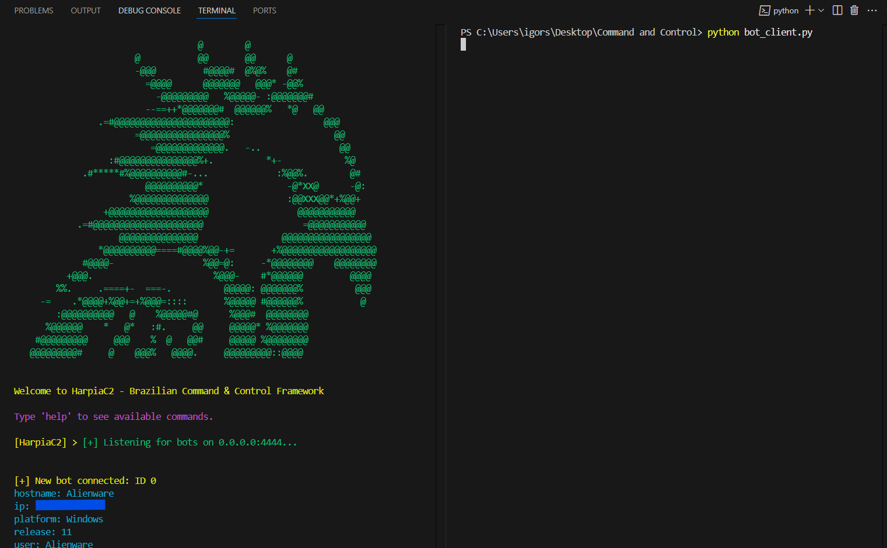

# Command and Control - Python Server & Bot Client 

This repository contains a Python-based proof of concept (PoC) for a simple Command and Control (C2) framework.  
The two Python scripts demonstrate how a bot client can execute commands on a victim’s machine and send the output back to a C2 server.

---

## Concept

This project simulates a typical **Command and Control (C&C)** scenario used in botnets or red team operations.

The **server** listens for connections from **bot clients**, which automatically connect to the C2 host and wait for instructions. Once connected, the server sends OS-level commands (e.g. `whoami`, `dir`, etc.), and the bot executes them and returns the results.

, the server (left side) is sending commands to the bot client (right side), which executes and returns the output back.

---

## Technologies Used

- Python 3.x
- Socket Programming (`socket`)
- Subprocess Execution (`subprocess`)
- TCP Protocol for communication

---

## Project Structure
```bash
mini_c2/
├── c2_server.py
├── c2_console.py
├── bot_client.py
├── modules/
│   └── commands.py   
├── utils/
│   └── helpers.py      
└── README.md
```
---

## How to Use

1. Open two terminals.
2. Run the server in the first one:

```bash
python c2_server.py
